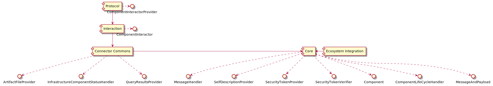

# International Data Spaces Components

This is a set of Java libraries to assist development of IDS Infrastructure Components such as Brokers or Connectors. The idea is
to separate concerns of, e.g., communication protocols or message handling into components so that they can be combined and
reused independent of each other in new projects. 

## Architecture

The diagram above provides an overview on the currently available library components (boxes) and the interfaces they provide (circles). 
The components and their responsibilities are as follows:

* **Core:** Central architectural component that implements the core business logic to deal with IDS Messages and data payloads. All other 
components (transitively) depend on this component.

* **Connector Commons:** Provides functionality that is useful for each connector, such as registering at a Broker, dealing with artifact 
requests or operation invocations.

* **Interaction:** Encapsulates interaction with a (Core) Component and deals with de/serialization of Information Model Entities.
 
* **Protocol:** Provides technical interfaces (e.g., HTTP) to interact with a component.

* **Ecosystem Integration:** Covers functionality to be executed when a component integrates into the IDS environment, such as 
retrieving or validating a security token.

## Status

The modules are currently used by the EIS-Broker implementation and usage by future Connector implementations is planned. Hence,
especially the "Connector Commons" module is currently unfinished.

## Related Documents

* [IDS Handshake Document](https://industrialdataspace.jiveon.com/docs/DOC-1817): which describes the concepts of communication on the 
IDS in textual form. 

* [IDS Information Model](https://github.com/IndustrialDataSpace/InformationModel): underlying domain model for the IDS, formalized as
an RDF-based ontology.

## Contributors

* Christian Mader (Fraunhofer IAIS)
* Matthias Böckmann (Fraunhofer IAIS)
* Dileep Ramachandrarao Krishna Murthy (Fraunhofer IAIS)
* Tim Wirtz (Fraunhofer IAIS)
